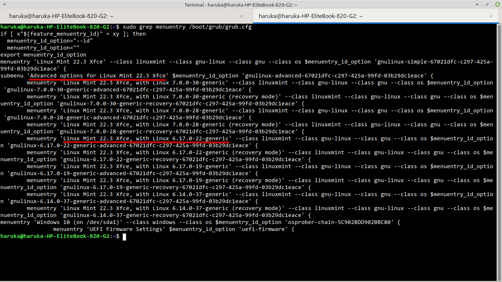

+++
date = '2026-08-30T15:56:49+08:00'
draft = false
title = 'HP EliteBook 820 G2 将内核升级至 7.0.0-30 Generic 后出现屏幕背光控制问题'
+++

> 机器：HP EliteBook 820 G2（Broadwell, HD 5500）
>
> 发行版：Linux Mint 22.3
>
> 桌面环境：XFCE
>
> 内核：7.0.0-30-generic

> 本文描述的问题应该适用于 `Intel HD 5500（Broadwell 平台）` 且内核为 `7.0.x` 的机型。

## 问题描述

最近我在自己的机器上将内核升级为 `7.0.0-30` 后，发现出现了亮度调节失效的问题。拖动亮度调节滑块和使用 Fn 键尝试调节亮度时，发现虽然图形界面上的亮度条确实发生了变化，但是实际上却不能感觉到屏幕有任何的亮度变化。

后来我又尝试使用 `brightnessctl` 在 `root` 权限下进行控制，发现 `/sys/class/backlight/intel_backlight` 值确实发生了变化，但是屏幕亮度仍然没有发生变化。

## 问题根因

经过搜索，我发现了一个一模一样的案例：

> [Launchpad #2161562](https://bugs.launchpad.net/ubuntu/+source/linux/+bug/2161562)：*"Backlight control broken on HP EliteBook 820 G2 (Broadwell) after upgrade to 7.0.0-28-generic"*

因此可以基本确定这是一个内核 bug：在软件驱动层面，对于亮度数值的调节是正常的，但是由于内核 7.0 系列 i915 默认启用 DPCD 背光通道，老 eDP 面板不响应。

## 修复方法

### 方法一：用旧内核启动

首先重新启动，启动时，在 grub 界面选择 `Advanced Options for <your distro>`，并选择 `6.17.0` 或者更老的内核启动，然后看看显示亮度能否正常调节，如果可以，则可以把默认启动切回老内核。

如果完全不需要 7.0 内核，可以直接把内核卸载掉，这样启动就会默认用 6.x 版本了：

```Shell
sudo apt remove linux-image-7.0.0-28-generic linux-image-7.0.0-30-generic
sudo update-grub
```

如果还想要保留 7.0 内核，可以修改 GRUB 配置文件。首先查看菜单条目名：

```Shell
sudo grep menuentry /boot/grub/grub.cfg
```

你会看到这样的内容，注意红线标出的位置，选择一个 6.x 版本的内核，记住你的机器上的输出：



然后先备份配置：

```Shell
sudo cp /etc/default/grub /etc/default/grub.bak
```

再修改配置：

```Shell
sudoedit /etc/default/grub
```

把 `GRUB_DEFAULT=0` 改成子菜单形式（用 `>` 分隔子菜单和条目），例如在我的机器上要修改成：

```
GRUB_DEFAULT="Advanced options for Linux Mint 22.3 Xfce>Linux Mint 22.3 Xfce, with Linux 6.17.0-22-generic"
```

然后更新 GRUB 配置：

```Shell
sudo update-grub
```

再次启动时默认使用的就是 6.x 内核，亮度问题应该就被解决了。

### 方法二：修改启动参数

如果还想使用 7.0 内核，可以使用以下方法修复：

先测试增加临时内核参数是否有效。重启，启动时在 GRUB 菜单按`e`编辑默认启动项。

找到 `linux` 开头的那一行，在行尾追加参数 `i915.enable_dpcd_backlight=0`（注意和前面的参数用空格隔开），然后按 `Ctrl + X` 启动，进入系统后若可以正常调节亮度，则该方法有效，可以直接添加启动参数来固化修复。

首先备份 GRUB 配置：

```Shell
sudo cp /etc/default/grub /etc/default/grub.bak
```

接下来编辑 GRUB 配置：

```Shell
sudoedit /etc/default/grub
```

找到 `GRUB_CMDLINE_LINUX_DEFAULT="..."` 那一行，在引号内追加 `i915.enable_dpcd_backlight=0` 。

然后更新引导：

```Shell
sudo update-grub
```

再次重启，问题应该得到修复。

## 后续

针对方法一，`apt` 会同时移除元包 `linux-image-generic-hwe-24.04`；将来官方修复后想切回新内核，执行 `sudo apt install linux-image-generic-hwe-24.04` 即可。

针对方法二，如果官方后续修复了内核中的这一问题，那么到时候移除相关配置参数即可。

建议订阅跟踪 [Launchpad #2161562](https://bugs.launchpad.net/ubuntu/+source/linux/+bug/2161562) 以获取最新信息。
