+++
date = '2026-08-16T19:58:13+08:00'
draft = false
title = '九寨沟'
+++

    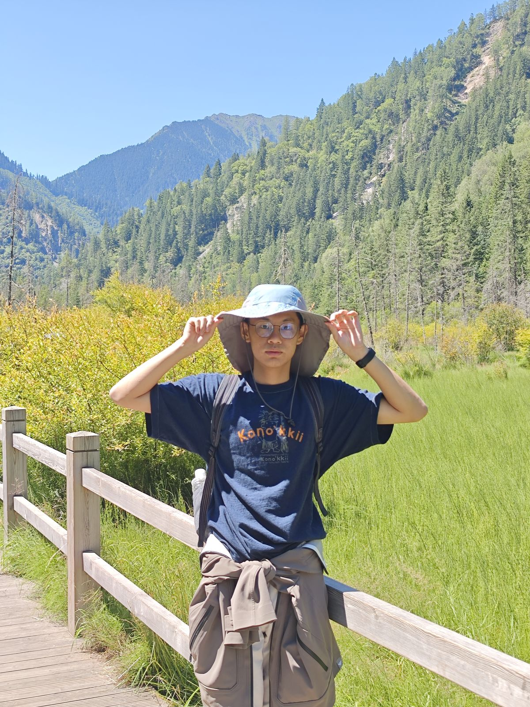
      我在九寨沟

小学的时候学过一篇九寨沟的课文，应该是在苏教版四年级上册，就一直想去看看九寨沟到底是不是书上说的“充满诗情画意的人间仙境”。2017年，九寨沟发生了7.0级的大地震，据说一些景观就此消失了。一想到以后再也没有机会欣赏书上所描绘的景象，我就后悔得扼腕叹息。

今年暑假，本来正愁想不到要去哪里玩一遭，却突然想起儿时的遗憾，便终于决定来一睹人间仙境的真容。

九寨沟位于四川省西北部的阿坝藏族羌族自治州九寨沟县。我们在前一天下午乘高铁从成都东站出发，前往黄龙九寨站，大约两个小时的车程。到站后，我们又乘大巴前往彭丰县漳扎村，住在一家民宿。不幸的是，当天高铁晚点了一个半小时，导致我们快1点才到民宿，第二天又要早起，特别疲惫。

## 交通

九寨沟位于四川省西北部的阿坝藏族羌族自治州九寨沟县。我们从成都出发，买了从成都东到黄龙九寨站的高铁票，车程大约2个小时。这里的高铁给我的体验特别差，首先是晚点的问题，原本六点半开的车，硬是晚点到8点才开，铁路局也没有给任何解释，等我们到民宿已经快1点了，第二天还要早起，特别地疲惫；其次，车上环境也比较差，总是有人走来走去、有人大声打电话、有小孩大声哭闹，让我感到非常烦躁。

到了黄龙九寨站后，我们接着坐大巴前往彭丰村漳扎镇。这里大巴两个多小时的车程。到站的话还好，因为大巴和火车是匹配的，所以火车晚点大巴也会跟着等待，但是如果是离开的话，一定要预留三个半小时的时间，防止路上堵车导致赶不上火车。回程的大巴上有个旅游大使一直在拿小喇叭说话。他说海拔上升睡觉很危险，可能会再也醒不来了。不过由于我实在是太困了，所以还是“铤而走险”睡着了。

## 住宿

我们住在漳扎镇上的一个民宿，住宿体验非常不错。我们到得非常晚，但是店主还是亲自开车来大巴下车点接我们到民宿，第二天又开车接送我们去景区。酒店的房间很大很干净，房间有大落地窗，早上从透过窗户向外望去，能够看到小镇的全貌。镇上都是藏族风格的小平房，远处是连绵的大山，清晨的阳光从山间的缺口洒下来，照在我的脸上，感觉暖暖的，十分惬意。

    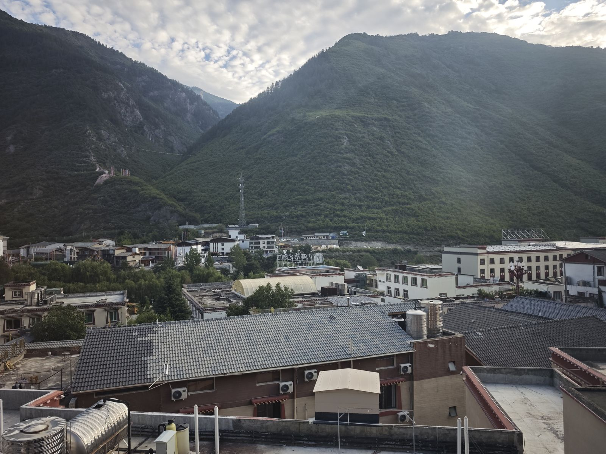 
    透过落地窗可以看到小镇的全貌

民宿含早餐，早餐非常丰盛，有包子、馒头、烧卖、鸡蛋、粥等等，其中最令我印象深刻的是他们家的烧卖和包子，应该是速冻的，但是忘记问他们买的是什么牌子的了，血亏啊。😭

## 景区

九寨沟是“y”字形（当然，为了掌握科技话语权，我们应该称之为“丫”字形），分为左中右三条线。一进景区大门到达的是中线树正沟，在诺日朗换成中心，路线被分成了两条，左线是则渣洼沟，在沟的最上面是五彩池，右线是日则沟，沿线景观密布，适合边走边玩。

    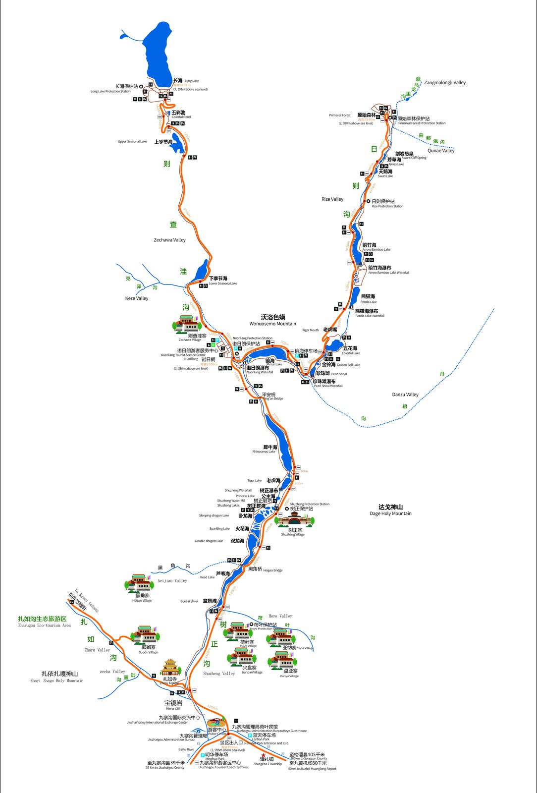 
    九寨沟地图

我们这次玩的是右线和中线，一路边走边看。景区里面有类似公交车的大巴，将各个景点串联起来。大巴车次非常多，基本上到了站点就能上车，不用担心因为等车而浪费时间。车上会有一名导游介绍景观并指导游客进行上下车换乘前往想要去的景点。全程基本上没有遇到什么通勤上的问题。

### 树正寨——老虎海

一上来，我们被大巴扔在了树正寨，需要向上步行走到老虎海才能够继续往上坐车。这是我们来九寨沟后走的第一段路。一下车我就忍不住到处乱拍，因为我真的已经好久没有见过如此美丽的自然风光了。

首先看到的是公主海。群山像护卫一样，将公主海严严实实地守护在中间，不知这是否是名字的来源？从高处往下看，河水从群山之间的狭窄缺口流入，又从下游的缺口流出，湛蓝的公主海好像项链上的一颗蓝色珍珠，耀眼夺目。

    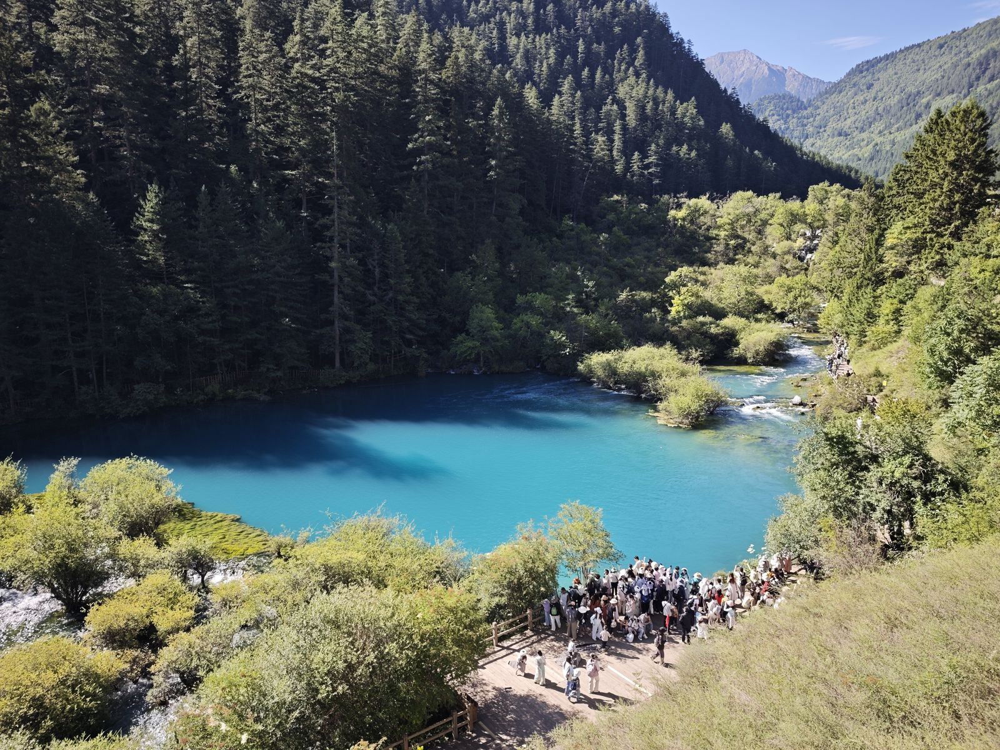
      公主海

再往上走是老虎海。与公主海不同，老虎海的蓝中有带了一些绿的感觉。由于四周被群山环抱，老虎海的水面十分平静，除了小鱼在水面游动时搅动水面之外，几乎看不到波纹。因此，老虎海能够清晰地照出远处群山的倒影，鱼儿似乎是在空气中遨游，柳宗元说的“皆若空游无所依”，大概就是这种感觉吧。

    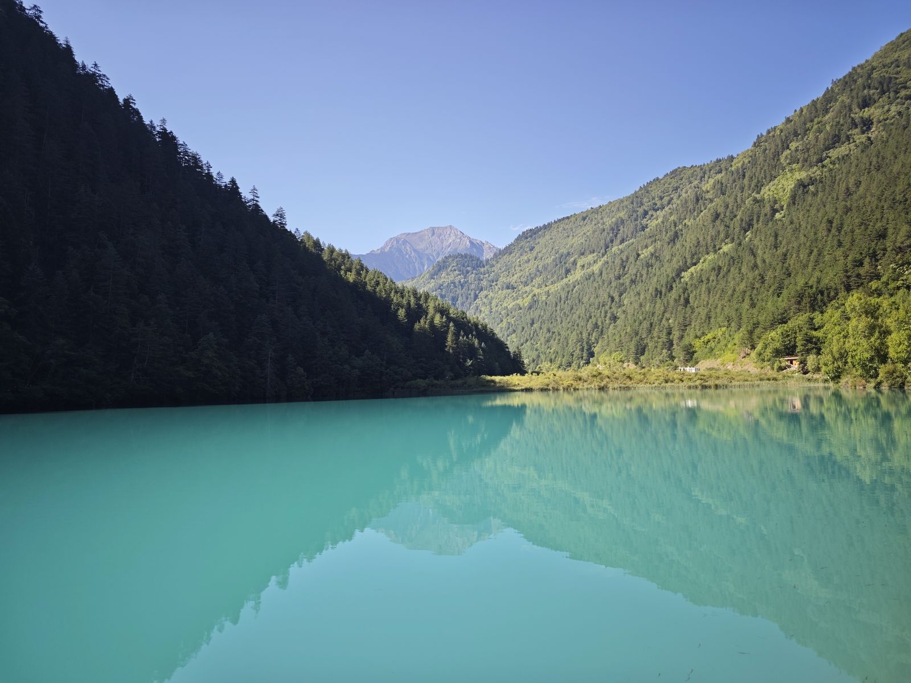
      老虎海

### 箭竹海——箭竹海瀑布

走到老虎海和犀牛海之间的车站，我们一路坐车来到右线的箭竹海。这里的山上长满了箭竹，据说箭竹开花的时候会特别好看，可惜这次是没法看到了。

一下大巴，呈现在眼前的是一片沼泽地，里面长满了翠绿的草，看上去有一米高，随着山间的微风左右摇晃。再向远处望去，山坡上是茂密的原始森林，蜿蜒的小溪从林间流淌出来。再向转头向公路望去，可以看到前几天刚发生的泥石流留下的痕迹：光秃秃的山体、倒伏的树木和山脚下人工搭建的加固围墙，公路上还停着几辆应急的车辆。看到这里，我不禁感到自己运气真好，刚好错过了泥石流。

绕箭竹海一圈有木制栈道。我们顺着栈道走入林中，透过低垂的枝叶向右看，可以窥见箭竹海的全貌。宽阔的湖面、碧绿的湖水，宛如镶嵌在大地上的一颗翡翠，引得游客频频赞叹。

    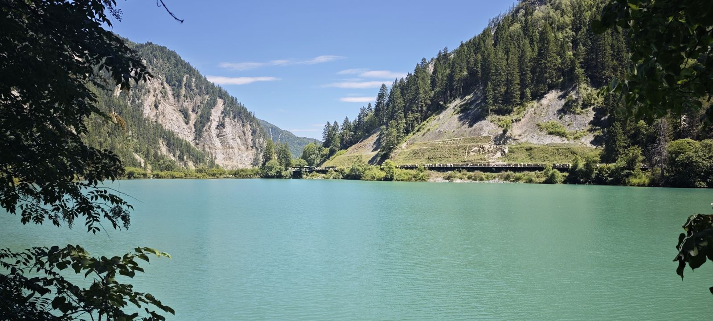
      箭竹海

绕到箭竹海的下方，就来到了箭竹海瀑布。这个瀑布落差不大，整体感觉也就2-5米的样子，不过由于瀑布基本上是箭竹海的横截面，所以宽度很大，感觉有一百来米，呈弧形。因此虽然瀑布说不上壮观，却也还值得玩味。

离开瀑布接着往下走，栈道紧贴着溪流上方通过，在栈道上走着，可以听到哗哗的水声、感受到沁凉的水汽，我顿时忘记了炽热的阳光，感觉舒服极了。在箭竹海和熊猫海之间，还散落着一些小湖泊，栈道玩玩绕绕从它们旁边经过。与气势滂沱的大湖相比，这些小湖的湖水更加清澈澄净、光线更加精致、景观也更有纵深，欣赏起来也别有一番风味。

    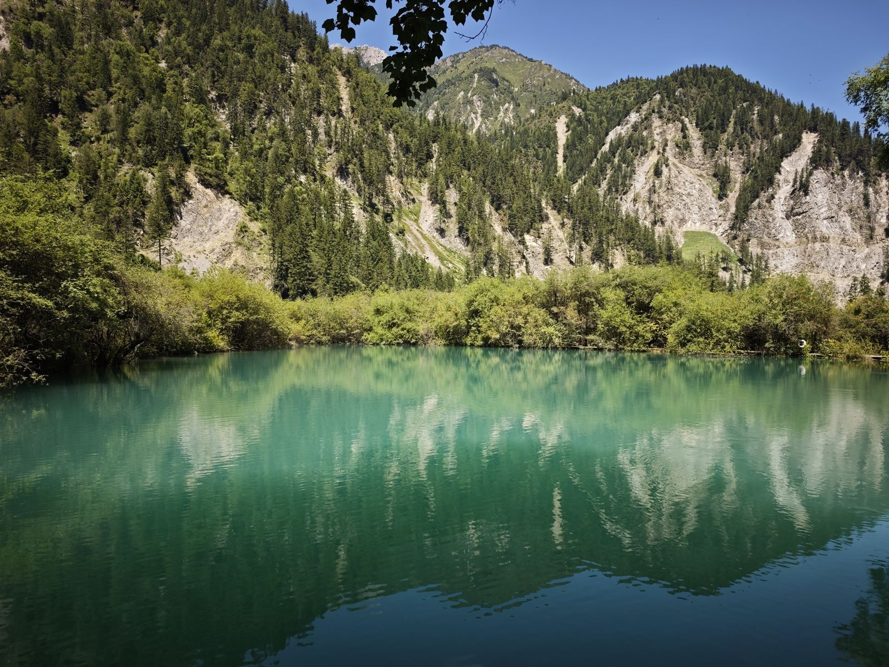
      地图上没有标注名字的小湖，也非常好看

### 熊猫海

总算走到了熊猫海。据说九寨沟以前是有大熊猫的，熊猫会从山上跑到熊猫海来喝水，所以称之为熊猫海。

2017年的地震摧毁了环熊猫海的栈道，故现在只能沿着公路徒步。公路建在一旁的山坡上，所以初见熊猫海时是从上往下俯视的视角，可以将宽阔的海子尽收眼底。只可惜相机的画幅终究是有限的，无法完美地再现当时我眼中所见到的壮丽景象。公路逐渐下降，我们也渐渐地靠近了水面。湖水倒映着群山和天空，我已经分不清到底是湖水的蓝还是天空的蓝了。

    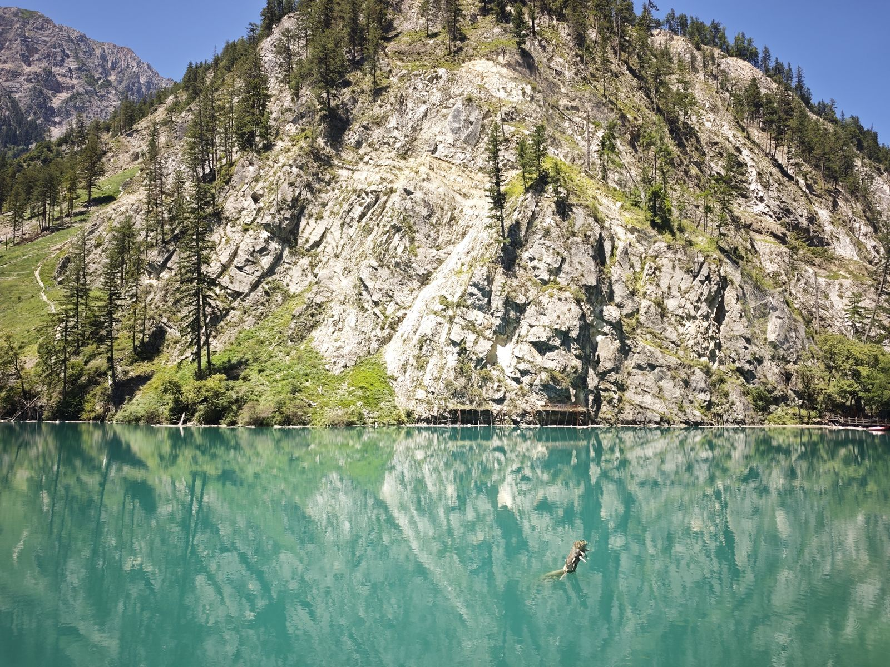
      熊猫海，隔着海子还能够看到对面被地震破坏的栈道

熊猫海下面是熊猫海瀑布，但是栈道坏了，从公路上看不到，便只好继续乘车前往五花海了。

### 五花海

五花海是九寨沟的精髓。这里的湖水很浅，水下有各种枯木、青苔、钙华、乱石，形成了一个五彩缤纷的水下世界，真想变成一条鱼儿去水底畅游一番啊。据说如果从高空向下看去，五花海会像一只开屏的孔雀一样，令人眼花缭乱。听说枯木掉入水中后，钙华会在枯木表面沉积，将枝干包裹起来，因此这些水中的木头永远也不会腐烂，形成了各种奇异的景观。不愧是人间仙境，这里的湖水竟然有这种使树枝“长生不老”的效果！如果人喝了之后能够青春永驻就好了。

    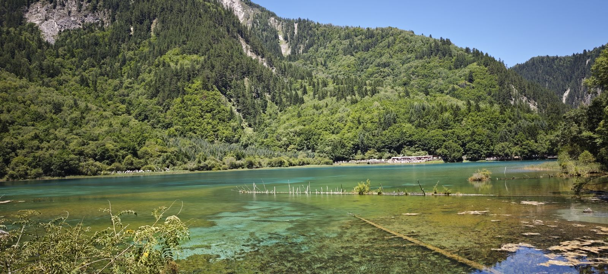
    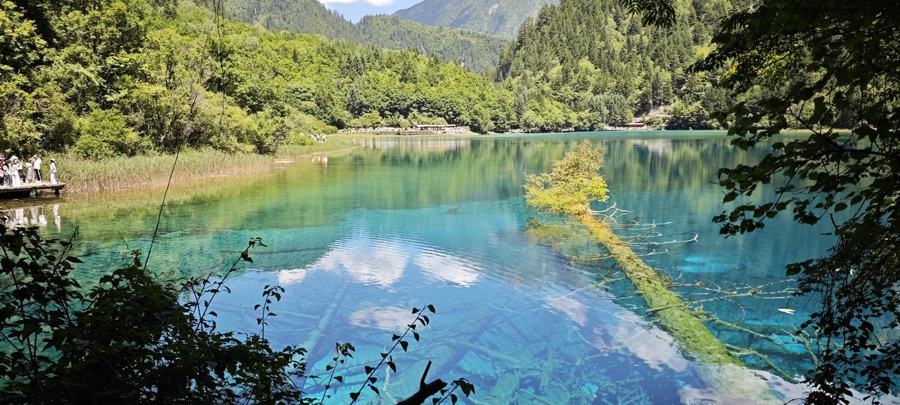
      变化无穷的五花海

### 珍珠滩——珍珠滩瀑布

珍珠滩瀑布是86版《西游记》的取景地。我们从上往下走，先看到的是瀑布的上游。一靠近便能听到滔天的水声，水流在这里被展开成一大片白色的浪花，咆哮着向着悬崖的边缘奔去，好像千万颗珍珠从山上快速滚落，这大概就是为什么取名为珍珠滩吧！

顺着栈道绕道悬崖下方，便能看见珍珠滩瀑布了。估计瀑布落差应该在15米以上，宽度接近200米，在背后的高山映衬下，十分壮观。冬天的时候，瀑布会被冻住，形成美丽的冰雕，可惜这次是无福享受这般景象了。

    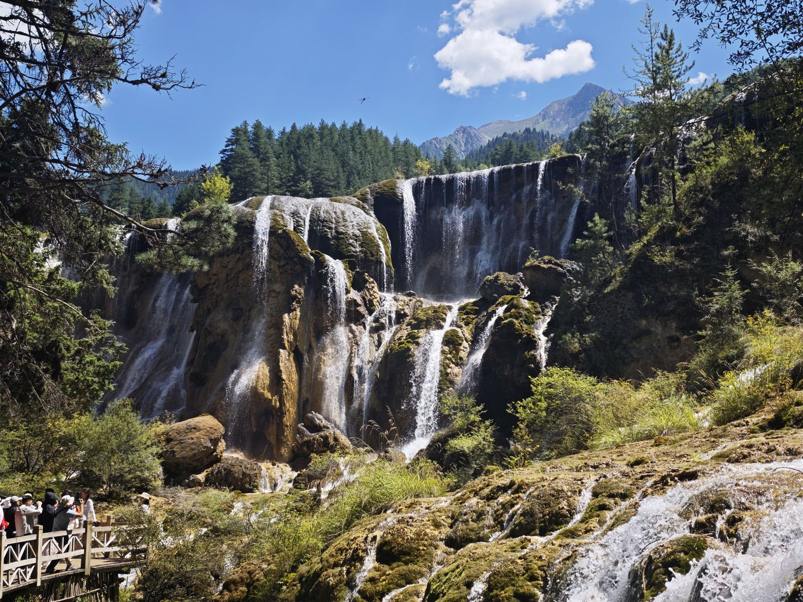
      珍珠滩瀑布

### 镜海

看完珍珠滩瀑布，我们坐大巴前往右线的最后一个景点——镜海。此时已经是下午三点，光线不是特别好，不过还是可以看到湖面像明镜一样，映照出远处的群山、森林和天空。

    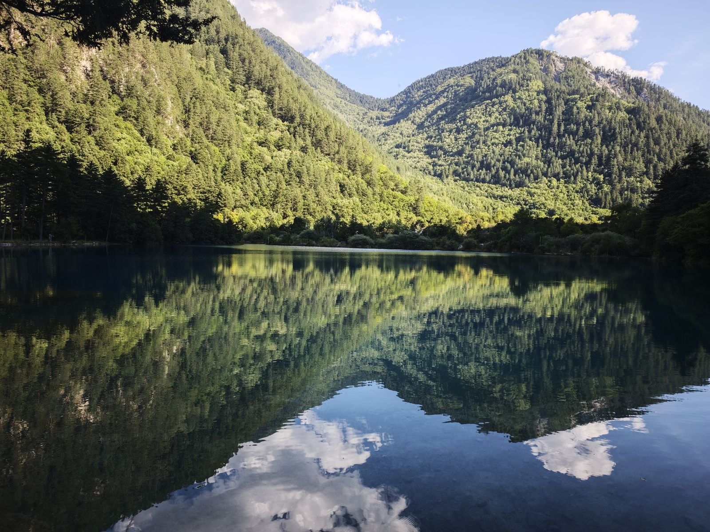
      镜海

### 火花海——芦苇海

乘大巴来到火花海，太阳照到水面上的时候，会有波光粼粼的景象，就好像火花在水里跳动。可惜我们到那边的时候太阳刚好被山给挡住了，只看到了普通的湖水，看不到这奇异的“火花”。

从火花海往下走，我们来到了双龙海和双龙海瀑布。这是17年地震后新形成的景观。瀑布呈一个“V”字型，把观景平台夹在中间。水流从巨石上散落下来，好像巨龙张开的爪子。

    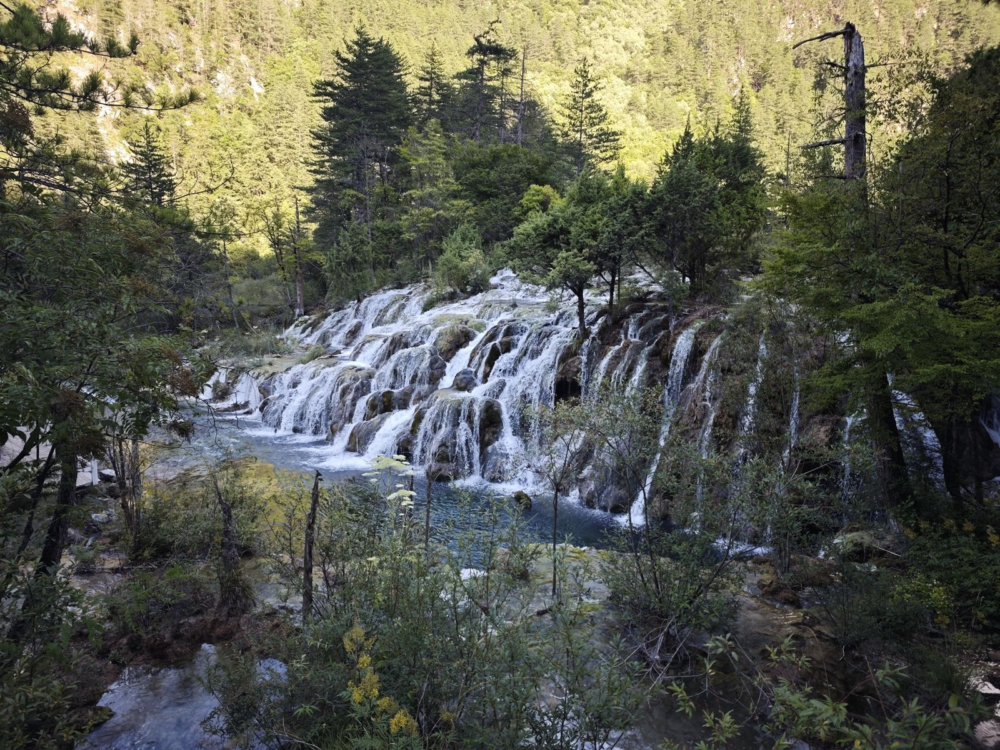
      双龙海瀑布

再往下是芦苇海。地势到这里开始变平，与其说是海子，倒不如说这是一条曲流，缓缓地向着前方流去。岸边长满了大片齐人高的芦苇，风吹过的时候，芦苇就开始随风摆动，好像波浪一样，原来是芦苇的“海”！据说芦苇海在夕阳的时候来看是最美的，但是很可惜我们是夏天来的，到芦苇海的时候都已经6点还没到夕阳西下的时刻，反倒是阳光被山给挡住了，整片芦苇荡阴沉沉的，没有想象中的那么惊艳。

    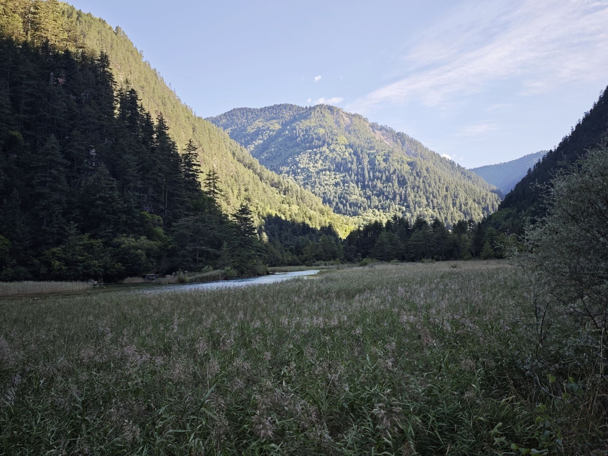
      芦苇海

离开芦苇海，我们的九寨沟之旅也就正式结束了。不愧是人间仙境，还真是让人有点流连忘返。